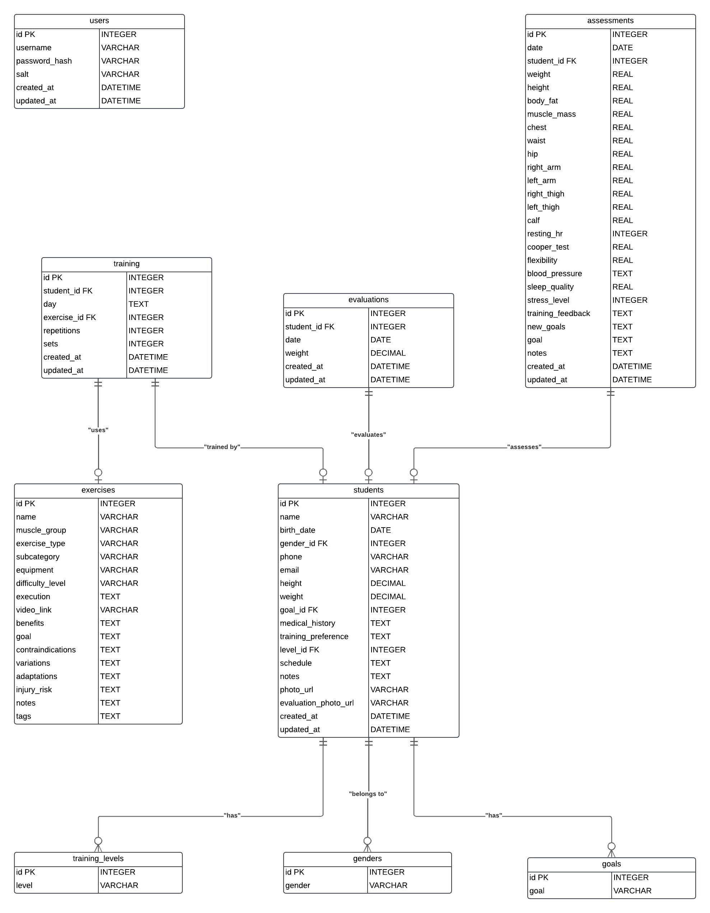

# FitTrack

## Description

**FitTrack** is a web-based application designed for efficient physical fitness assessment, exercise routines, and management of students' profiles. The app is based on the Flask framework and, therefore, assures efficiency and friendliness of service to the trainers when tracking students' progress in physical improvement, while at the same time helping students keep track of their personal development.

The structure for this project has scalability in mind so that it will handle not just the growing numbers of users but also an ever-expanding set of features. This project strikes a balance in that it combines cleanliness in the front end with strengths in the back to create one heck of a user experience.

---
## Features

1. **User Authentication**:

- Secure login and registration
- Passwords hashed for security; hence, not stored in plain text in the database.
2. **Student Management**:

    - Adding, viewing, and editing of student profiles.
    - Maintaining detailed records for each and every student.
3. **Exercise Management**:

    - Creation and management of exercise routines.
    - Categorization of exercises for easy navigation.
4. **Physical Assessments**:
- Record, track, update physical assessments for students.
    - Visual reports on progress.
5. **Progress Monitoring**:
   	
   	• Data visualization through graphs and charts
   	• Compare Progress across different periods.

---

## Project Structure

The project is organized using a modular structure in order to keep it clean and reusable. A quick overview of the most important directories and files follows.

### Main Directories and Files

```
project/
│
├── app/                           # Application module
│   ├── __init__.py                # Initializes the Flask application
│   ├── db.py                      # Manages database connections and functions
│   ├── routes/                    # Contains route definitions for different modules
│   │   ├── __init__.py            # Registers routes
│   │   ├── assessments.py         # Routes for handling physical assessments
│   │   ├── auth.py                # Routes for authentication (login/register)
│   │   ├── exercises.py           # Routes for managing exercises
│   │   ├── register_training.py   # Routes for training registration
│   │   ├── students.py            # Routes for managing student profiles
│   ├── utils.py                   # Helper functions used throughout the app
│
├── static/                        # Static assets (CSS, JavaScript, images)
│   ├── asset/                     # Assets organized by type
│   │   ├── favicon/               # Favicon files
│   │   ├── icon/                  # Icons used in the interface
│   │   ├── png/                   # PNG images
│   │   ├── styles/                # CSS stylesheets
│   │   │   ├── theme.css          # Global theme styles
│   │   │   ├── responsiveness.css # Media queries for responsive design
│   │   │   ├── animations.css     # Animations for visual effects
│   │   │   ├── tables.css         # Styling for tables
│   │   ├── uploads/               # Directory for uploaded files
│
├── script/                        # JavaScript files
│   ├── modules/                   # Modularized JS for specific functionalities
│   │   ├── dropdown.js            # Manages dropdown menus
│   │   ├── exerciseTable.js       # Handles interactive exercise tables
│   │   ├── flashMessages.js       # Displays temporary messages to users
│
├── templates/                     # HTML templates
│   ├── base.html                  # Base template for the app
│   ├── index.html                 # Homepage template
│   ├── dashboard/                 # Templates for the dashboard
│   │   ├── exercises.html         # Exercise dashboard
│   │   ├── student_profile.html   # Student profile page
│   ├── forms/                     # Form templates (login, registration, etc.)
│
├── database.py                    # Database initialization script
├── Readme.md                      # Project documentation
├── run.py                         # Main script to run the app
```


## Design Choices



### Database

For database management, SQLite is used. This choice is because SQLite is light and quick to set up. Besides, it doesn't require much configuration. There are tables for the following schema:

- **Users**: The table stores user credentials along with roles.
- **Students**: Stores personal information and student records.
- **Exercises**: Exercise database.
- **Assessments**: Keeps track of each student's assessment.

### Backend

The backend is developed with Flask because it is simple, flexible, and very well-suited for out-of-the-box modular development. Flask allows for rapid prototyping and easily integrates with third-party extensions, including Flask-WTF for forms and Flask-Bcrypt for password hashing.

### Frontend

The frontend is developed in HTML, CSS, and JavaScript. A responsive design methodology has made it device usable; this was achieved using CSS media queries. Interactivity is handled by JavaScript modules to further enhance user experience without overloading the backend.

---
## Development Process

1. **Planning**: 
    A well-detailed plan for the app's functionality, database schema, and interface was made. It was focused on modularity to accommodate enhancements in the future.
2. **Implementation**:

- Routing and database operations were set up with Flask.
- The definition of the database schema and its initialization was done through `database.py`.
- In tandem, the development of the frontend was done with the mindset of responsiveness and accessibility in mind.
3. **Testing**:
Extensive testing to ensure that everything was working right:

    - Backend: Unit tests for database operations and routes.
    - Frontend: Testing across various devices and browsers.

---
 
## Challenges and Solutions

- **Responsive Design:
Ensuring the app looked and functioned well on various devices was not easy. This was overcome by using CSS media queries and testing iteratively on a variety of screen sizes.

- **Secure Authentication** : 
    The main work in implementing secure login and registration was integrating Flask's security features, such as password hashing and session management.

---
## Future Improvements

- **Mobile Application**:
Develop a mobile app for enhanced accessibility.
 
- **Advanced Reporting**: 
    Provide comprehensive analytics and insights, like weekly and monthly summaries regarding the progress.
 
- **Integration with Wearables**: 
    Let the system automatically sync data from wearables to enrich the assessments.
 
---
 
## How to Run the Project

1  **Clone the repository**:
```bash
git
cd
```

2  **Create virtual environment**:

```bash
python -m venv venv
source venv/bin/activate  # On Windows: `venv\\Scripts\\activate`
```

3  **Install dependencies**:
```bash
pip install -r requirements.txt
```

4  **Initialize the database**:
  
```bash
python database.py
```

5  **Run the application**:
 
```bash
python run.py
```
6 **Open the app**: 
Open your browser and type in:

```
http://127.0.0.1:5000
```
